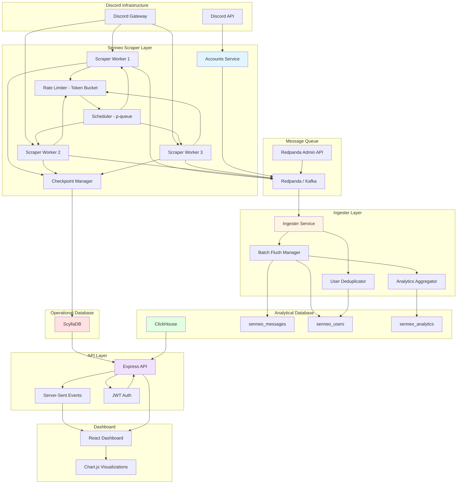

# Senneo System Architecture Overview

> **Version:** 1.0  
> **Last Updated:** 2026-04-10  
> **Author:** Senneo Team

---

## 📐 System Architecture Diagram



---

## 🏗️ Component Hierarchy

### 1. Scraper Layer (`@senneo/accounts`)

**Purpose:** Multi-account Discord message scraping with rate limiting and checkpointing

**Key Components:**

| Component | File | Lines | Description |
|-----------|------|-------|-------------|
| **Main Orchestrator** | `index.ts` | 1322 | Startup, scheduling, queue management |
| **Core Scraper** | `scraper.ts` | 727 | Scrape loop, rate limiter, fetch logic |
| **Checkpoint Manager** | `checkpoint.ts` | 175 | Load/save scrape state |
| **Kafka Producer** | `producer.ts` | 216 | Message publishing to Kafka |
| **Database Client** | `db.ts` | 341 | ScyllaDB operations |
| **Proxy Manager** | `proxy.ts` | 264 | HTTP proxy pool management |
| **Guild Sync** | `guild-sync.ts` | 339 | Periodic guild re-sync |
| **Event Logger** | `scrape-event-log.ts` | 109 | Event emission for SSE |

**Concurrency Model:**
```
p-queue with concurrency=5 (per account)
│
├── Account 1: 5 parallel channel scrapes
├── Account 2: 5 parallel channel scrapes
└── Account N: 5 parallel channel scrapes

Time-slicing: yield after MAX_BATCHES_PER_RUN (50 batches)
Re-queue for fair RoundRobin scheduling
```

### 2. Ingester Layer (`@senneo/ingester`)

**Purpose:** Kafka consumer → ClickHouse batch writer

**Key Components:**

| Component | Description |
|-----------|-------------|
| **Kafka Consumer** | 16 partitions, 8 concurrent consumption |
| **Batch Flush** | 2,000 msg batch, 250ms max wait |
| **User Identity** | `users_latest` + `user_identity_log` |
| **Analytics** | `author_daily`, `channel_daily`, `guild_daily` |
| **DLQ Handler** | Unparseable messages → dead letter queue |

**Insert Pipeline:**
```
Kafka Message → Parse → Validate → Batch Buffer
                                              │
                                              ▼
                                      Flush on:
                                      - 2,000 messages
                                      - 250ms elapsed
                                              │
                                              ▼
                                  ClickHouse INSERT
                                  (async, at-least-once)
```

### 3. API Layer (`@senneo/api`)

**Purpose:** REST API + Dashboard backend

**Route Structure:**
```
/api/
├── /live/*          - Real-time stats (SSE)
├── /accounts/*      - Account management
├── /guilds/*        - Guild inventory
├── /scraping/*      - Scraping control
├── /auth/*          - JWT authentication
├── /archive/*       - Account archival
├── /alerts/*        - Alert rules
├── /proxy/*         - Proxy management
└── /health          - Health check
```

### 4. Bot Layer (`@senneo/bot`)

**Purpose:** Discord self-bot → Kafka producer (alternative to accounts HTTP fetch)

**Note:** Currently minimal functionality, accounts service is primary scraper

---

## 🔄 Data Flow

### Message Scraping Flow

```
1. Discord API (HTTP fetch)
   ↓
2. Scraper (100 msg/batch, raw HTTP)
   ↓
3. Rate Limiter (Token Bucket: 60/s channel, 300/s account)
   ↓
4. Kafka Producer (LZ4 compression, 16 partitions)
   ↓
5. Ingester (Kafka consumer, 8 concurrent)
   ↓
6. ClickHouse INSERT (2,000 msg batch)
   ↓
7. Materialized Views (analytics aggregation)
```

### Checkpoint Flow

```
1. Scraper fetches batch
   ↓
2. Update cursor (oldest message ID)
   ↓
3. Write to ScyllaDB (scrape_checkpoints)
   ↓
4. On crash/restart: load checkpoint
   ↓
5. Resume from cursor (no duplicates)
```

### User Identity Flow

```
1. Ingester receives message with author snapshot
   ↓
2. Query users_latest (ScyllaDB cache)
   ↓
3. If changed: insert to user_identity_log (ClickHouse)
   ↓
4. Update users_latest (ReplacingMergeTree)
```

---

## 🔐 Security Model

### Authentication

| Component | Method | Storage |
|-----------|--------|---------|
| **Dashboard** | JWT | ScyllaDB (`auth_tokens`) |
| **API** | JWT bearer | ScyllaDB (`auth_tokens`) |
| **Scraper** | Discord token | `accounts.json` (local) |

### Authorization

- Admin access: Full control
- User access: Read-only (dashboard)

### Data Protection

- Discord tokens: Never logged
- User passwords: Bcrypt (not implemented yet)
- Kafka: LZ4 compression (in-transit)
- ClickHouse: ZSTD compression (at-rest)

---

## 📊 State Management

### In-Memory State (Accounts Service)

| State | Type | Purpose |
|-------|------|---------|
| `queues` | `Map<accountId, PQueue>` | Concurrent scrape queues |
| `clients` | `Map<accountId, DiscordClient>` | discord.js clients |
| `enqueued` | `Set<channelId>` | Currently enqueued channels |
| `runningChannelsByAccount` | `Map<accountId, Set<channelId>>` | Active scrapes |
| `scrapeStats` | ScyllaDB table | Per-channel stats |
| `checkpoints` | ScyllaDB table | Scraping progress |
| `controlOverlay` | Object | Pause/resume state |

### Persistent State (ScyllaDB)

| Table | Update Frequency | Size |
|-------|------------------|------|
| `scrape_checkpoints` | Every batch | ~50 MB |
| `scrape_stats` | Every batch | ~250 MB |
| `scrape_targets` | On sync | ~25 MB |
| `auth_tokens` | On login | <1 MB |

---

## 🚀 Scalability Model

### Horizontal Scaling

| Component | Scaling Strategy |
|-----------|------------------|
| **Accounts** | Add more accounts (linear) |
| **Ingester** | Add more consumers (partition-based) |
| **ClickHouse** | Add shards (replication) |
| **ScyllaDB** | Add nodes (ring topology) |
| **API** | Add instances (load balancer) |

### Bottlenecks

1. **Rate Limiter:** Global Map → Sharded buckets
2. **ClickHouse Insert:** Single-thread per shard → Async inserts
3. **ScyllaDB Compaction:** Tombstone storm → TTL on checkpoints
4. **Kafka Partitions:** Too few → Increase to 48

---

## 📈 Performance Characteristics

### Throughput

| Metric | Value | Notes |
|--------|-------|-------|
| Scraping | ~1,200 msg/s | 3 channels × 100 msg × 4 batches/s |
| Kafka | 40 MB/s compressed | LZ4 5:1 ratio |
| ClickHouse Insert | ~2,000 msg/250ms | 8,000 msg/s per ingester |
| API Query | <100ms | Point lookup (100B rows) |

### Latency

| Operation | P50 | P99 | Notes |
|-----------|-----|-----|-------|
| Discord fetch | 300ms | 1s | Rate limited |
| Kafka publish | 10ms | 50ms | Async |
| ClickHouse insert | 50ms | 500ms | Batch write |
| API query | 20ms | 200ms | Indexed |

---

## 🛠️ Configuration Management

### Environment Variables (Critical)

| Variable | Default | Description |
|----------|---------|-------------|
| `SCRAPE_BATCH_SIZE` | 100 | Messages per fetch |
| `FETCH_DELAY_MS` | 300 | Delay between fetches |
| `MAX_MSG_PER_SEC_CHANNEL` | 60 | Channel rate limit |
| `MAX_MSG_PER_SEC_ACCOUNT` | 300 | Account rate limit |
| `MAX_BATCHES_PER_RUN` | 50 | Time-slicing yield point |
| `INGESTER_BATCH_FLUSH_SIZE` | 2,000 | ClickHouse batch size |
| `KAFKA_PARTITIONS` | 16 | Topic partition count |

---

## 🔍 Monitoring & Observability

### Logs

| Component | Log Level | Destination |
|-----------|-----------|-------------|
| Scraper | Info/Warn | stdout |
| Ingester | Info/Error | stdout |
| API | Access/Error | stdout |

### Metrics (Planned)

- Scraping throughput (msg/s)
- Kafka consumer lag
- ClickHouse insert rate
- API response time
- Error rate by component

### Health Checks

- `/api/health` - API health
- ClickHouse `SELECT 1`
- ScyllaDB `SELECT now()`
- Kafka consumer group status

---

## 📝 Deployment Architecture

### Development

```
docker-compose up
├── clickhouse (single node)
├── scylladb (single node)
├── redpanda (single node)
├── accounts (single instance)
├── ingester (single instance)
└── api (single instance)
```

### Production (Recommended)

```
Kubernetes / Docker Swarm
├── ClickHouse: 3 shards × 2 replicas
├── ScyllaDB: 6 nodes (3 DC × 2)
├── Redpanda: 3 nodes (cluster)
├── Accounts: N instances (per account group)
├── Ingester: 8 instances (per partition)
└── API: 4 instances + Load Balancer
```

---

*End of Architecture Overview*
