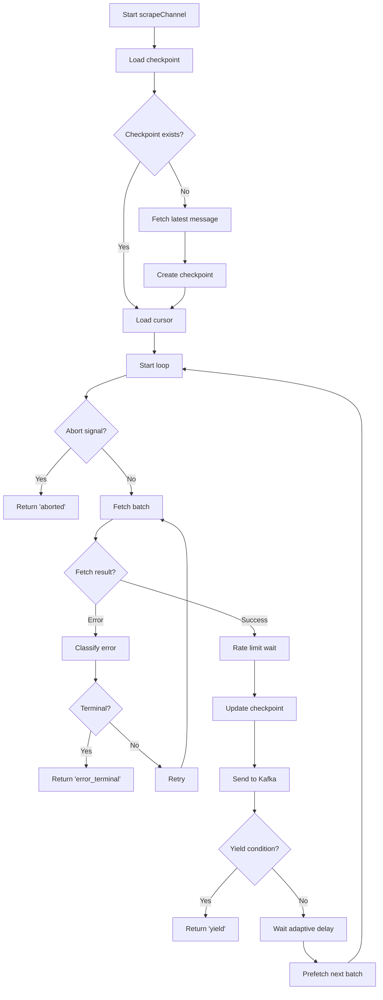

# Accounts/Scraper Service - Technical Documentation

> **Version:** 1.0  
> **Last Updated:** 2026-04-10  
> **Package:** `@senneo/accounts`  
> **Purpose:** Multi-account Discord message scraping orchestrator

---

## 📋 Table of Contents

1. [Overview](#overview)
2. [File Structure](#file-structure)
3. [Core Components](#core-components)
4. [Startup Sequence](#startup-sequence)
5. [Scraping Loop](#scraping-loop)
6. [Rate Limiting](#rate-limiting)
7. [Checkpoint Management](#checkpoint-management)
8. [Scheduling & Concurrency](#scheduling--concurrency)
9. [Kafka Integration](#kafka-integration)
10. [Proxy Support](#proxy-support)
11. [Environment Variables](#environment-variables)
12. [Error Handling](#error-handling)
13. [Code Reference](#code-reference)

---

## 🎯 Overview

The Accounts service is the heart of Senneo's scraping engine. It orchestrates multi-account Discord message scraping with:

- **Concurrent scraping**: 5 channels per account (configurable)
- **Rate limiting**: Token bucket algorithm (60 msg/s per channel, 300 msg/s per account)
- **Checkpointing**: Persistent progress tracking in ScyllaDB
- **Time-slicing**: Fair RoundRobin scheduling (yield after 50 batches)
- **Proxy support**: HTTP proxy pool for account isolation
- **Raw HTTP fetch**: Bypass discord.js REST manager for 5× speed

---

## 📁 File Structure

```
packages/accounts/src/
├── index.ts          (1322 lines) - Main orchestrator
├── scraper.ts        (727 lines)  - Core scraping logic
├── checkpoint.ts     (175 lines)  - Checkpoint persistence
├── producer.ts       (216 lines)  - Kafka producer
├── db.ts             (341 lines)  - ScyllaDB client
├── proxy.ts          (264 lines)  - Proxy pool management
├── guild-sync.ts     (339 lines)  - Guild re-sync
└── scrape-event-log.ts (109 lines) - Event emission
```

---

## 🧩 Core Components

### 1. Main Orchestrator (`index.ts`)

**Entry Point:** `main()` function (line 298)

**Responsibilities:**
- Account login & client initialization
- Channel enumeration & target assignment
- Queue management & scheduling
- State synchronization
- Graceful shutdown

**Key Data Structures:**

```typescript
// Queue management
const queues = new Map<string, PQueue>();  // accountId → queue
const clients = new Map<string, Discord.Client>();  // accountId → client

// State tracking
const enqueued = new Set<string>();  // Currently enqueued channel IDs
const runningChannelsByAccount = new Map<string, Set<string>>();
const channelRunToken = new Map<string, string>();
const abortHandles = new Map<string, AbortController>();

// Rate limiting
const scopeCooldowns = new Map<string, CooldownState>();
const accountBaseConcurrency = new Map<string, number>();
const accountRecoveryTimers = new Map<string, NodeJS.Timeout>();
```

### 2. Core Scraper (`scraper.ts`)

**Entry Point:** `scrapeChannel()` function

**Signature:**
```typescript
export async function scrapeChannel(
  client:      Discord.Client,
  guildId:     string,
  channelId:   string,
  onBatch:     (messages: RawMessage[]) => Promise<void>,
  onProgress?: (total: number) => void,
  signal?:     AbortSignal,
  accountId?:  string,
  throttleHooks?: ScrapeThrottleHooks,
  token?:      string,  // For raw HTTP fetch
): Promise<ScrapeChannelResult>
```

**Return Types:**
```typescript
type ScrapeChannelResult = 
  | { kind: 'completed', code?: string, reason?: string }
  | { kind: 'aborted', code?: string, reason?: string }
  | { kind: 'error_retryable', code?: string, reason?: string }
  | { kind: 'error_terminal', code?: string, reason?: string }
  | { kind: 'noop', code?: string, reason?: string }
  | { kind: 'yield', code?: string, reason?: string, totalScraped?: number }
```

### 3. Checkpoint Manager (`checkpoint.ts`)

**Functions:**
```typescript
export async function loadCheckpoints(): Promise<void>
export function getCheckpoint(channelId: string): Checkpoint | null
export async function setCheckpoint(cp: Checkpoint): Promise<void>
export function getAllCheckpoints(): Record<string, Checkpoint>
```

**Checkpoint Structure:**
```typescript
interface Checkpoint {
  guildId:        string
  channelId:      string
  newestMessageId: string
  cursorId:       string
  totalScraped:   number
  complete:       boolean
  lastScrapedAt:  string  // ISO datetime
}
```

### 4. Kafka Producer (`producer.ts`)

**Functions:**
```typescript
export async function createProducer(
  brokers: string[],
  topic:   string,
): Promise<{
  send:       (messages: RawMessage[]) => Promise<void>
  disconnect: () => Promise<void>
}>
```

**Configuration:**
```typescript
const MAX_MESSAGES_PER_REQUEST = 500
const SEND_COMPRESSION = LZ4  // 5:1 ratio
const MAX_INFLIGHT_REQUESTS = 10
const TARGET_TOPIC_PARTITIONS = 16
```

---

## 🚀 Startup Sequence

### Phase 1: Initialization (lines 298-302)

```typescript
const db = await getDb()
await loadCheckpoints()
await loadAccounts()  // Load from accounts.json
await initProxyPool()
const { send: sendToKafka, disconnect: disconnectKafka } = 
  await createProducer(KAFKA_BROKERS.split(','), KAFKA_TOPIC)
```

### Phase 2: State Management (lines 450-481)

```typescript
// Queue initialization
for (const [accId, account] of loadedAccounts) {
  const queue = new PQueue({
    concurrency: account.concurrency ?? CONCURRENT_CHNL,  // default 5
    timeout: SCRAPER_TIMEOUT_MS,
    throwOnTimeout: true,
  })
  queues.set(accId, queue)
  accountBaseConcurrency.set(accId, queue.concurrency)
}
```

### Phase 3: Chunked Login (lines 344-424)

```typescript
const LOGIN_CONCURRENCY = 10  // 10 accounts at a time
for (let i = 0; i < loadedAccounts.length; i += LOGIN_CONCURRENCY) {
  const chunk = loadedAccounts.slice(i, i + LOGIN_CONCURRENCY)
  await Promise.all(chunk.map(async ([globalIdx, account]) => {
    const client = await createClient(account)
    clients.set(account.id, client)
    // ... guild discovery
  }))
}
```

### Phase 4: Target Synchronization (lines 980-1100)

```typescript
async function syncTargets(targetsOverride?: WorkerTarget[]): Promise<void> {
  const targets = targetsOverride ?? await readTargets(db)
  // For each target:
  // 1. Check if already enqueued
  // 2. Check if paused
  // 3. Enqueue if ready
}
```

---

## 🔁 Scraping Loop

### Main Loop Structure (`scraper.ts` lines 590-716)

```typescript
while (true) {
  // 1. Check abort signal
  if (signal?.aborted) { break }

  // 2. Fetch next batch (parallel with previous Kafka send)
  const { rawMessages, result } = await nextFetch
  
  // 3. Handle fetch result
  if (result) { exit = result; break }
  if (!rawMessages) { exit = { kind: 'error_retryable' }; break }

  // 4. Rate limiting: consume tokens
  await channelBucket.consume(raw.length, signal)
  await accountBucket?.consume(raw.length, signal)

  // 5. Update checkpoint
  cursor = sorted[0].id  // Oldest message ID
  totalScraped += raw.length
  await setCheckpoint({ ...cp, cursorId: cursor, totalScraped })

  // 6. Fire Kafka send (don't await)
  pendingDelivery = onBatch(raw).catch(err => {
    console.error(`onBatch error: ${err?.message}`)
  })

  // 7. Check time-slicing yield
  if (batchesProcessedThisRun >= maxBatchesPerRun) {
    exit = { kind: 'yield', totalScraped }
    break
  }

  // 8. Wait before next fetch
  await waitFor(adaptiveDelay, signal)

  // 9. Prefetch next batch
  pendingRawFetch = doFetch(cursor)
}
```

### Raw HTTP Fetch (`scraper.ts` lines 203-265)

```typescript
async function rawFetchMessages(
  token: string,
  channelId: string,
  limit: number,
  beforeCursor: string | null,
  signal?: AbortSignal,
): Promise<any[]> {
  const url = `${DISCORD_API_BASE}/channels/${channelId}/messages` +
              `?limit=${limit}${beforeCursor ? `&before=${beforeCursor}` : ''}`

  const res = await fetch(url, {
    signal,
    headers: {
      'Authorization': token,
      'Content-Type': 'application/json',
      'User-Agent': 'Mozilla/5.0 ...',
    },
  })

  // Handle rate limits (429)
  if (res.status === 429) {
    const retryAfter = Number(res.headers.get('Retry-After') ?? '5')
    throw { status: 429, retryAfter }
  }

  return res.json()
}
```

---

## 🚦 Rate Limiting

### Token Bucket Algorithm (`scraper.ts` lines 48-98)

```typescript
class TokenBucket {
  private tokens: number
  private lastRefill: number

  constructor(
    private readonly maxTokens: number,
    private readonly refillPerSecond: number,
  ) {
    this.tokens = maxTokens  // Start with full bucket
    this.lastRefill = Date.now()
  }

  private refill(): void {
    const now = Date.now()
    const elapsed = (now - this.lastRefill) / 1000
    const newTokens = elapsed * this.refillPerSecond
    this.tokens = Math.min(this.maxTokens, this.tokens + newTokens)
    this.lastRefill = now
  }

  async consume(count: number, signal?: AbortSignal): Promise<boolean> {
    while (true) {
      if (signal?.aborted) return false

      this.refill()

      if (this.tokens >= count) {
        this.tokens -= count
        return true
      }

      // Calculate wait time
      const needed = count - this.tokens
      const waitMs = Math.ceil((needed / this.refillPerSecond) * 1000)

      if (!(await waitFor(Math.min(waitMs, 1000), signal))) {
        return false
      }
    }
  }
}
```

### Rate Limiter Configuration

| Parameter | Default | Description |
|-----------|---------|-------------|
| `MAX_MSG_PER_SEC_CHANNEL` | 60 | Channel bucket refill rate |
| `MAX_MSG_PER_SEC_ACCOUNT` | 300 | Account bucket refill rate |
| Burst capacity | `Math.max(rateLimit, BATCH_SIZE)` | Minimum 100 tokens |

**Critical Fix (2026-04-10):**
```typescript
// OLD (BUG): burst = rateLimit → 60 < 100 → INFINITE LOOP
// NEW (FIX): burst = Math.max(rateLimit, BATCH_SIZE) → 100
const burst = Math.max(MAX_MSG_PER_SEC_CHANNEL, BATCH_SIZE)
_channelBuckets.set(channelId, new TokenBucket(burst, MAX_MSG_PER_SEC_CHANNEL))
```

### Scoped Throttle (Advanced Rate Limiting)

**Hooks (`index.ts` lines 601-628):**
```typescript
const throttleHooks: ScrapeThrottleHooks = {
  beforeFetch: async ({ accountId, guildId, channelId, attempt }) => {
    const accountKey = `account:${accountId}`
    const guildKey = `guild:${accountId}:${guildId}`
    const channelKey = `channel:${accountId}:${channelId}`

    // Check cooldown state
    const state = scopeCooldowns.get(channelKey)
    if (state) {
      const blockedMs = state.cooldownUntil - Date.now()
      if (blockedMs > 0) return blockedMs
    }
    return 0
  },

  onRateLimit: async (event) => {
    // Register cooldown on account, guild, and channel
    registerScopeCooldown(`account:${event.accountId}`, event.waitMs)
    registerScopeCooldown(`guild:${event.accountId}:${event.guildId}`, event.waitMs)
    registerScopeCooldown(`channel:${event.accountId}:${event.channelId}`, event.waitMs)

    // Reduce concurrency
    reduceAccountConcurrency(event.accountId, event.guildId, event.channelId)

    // Schedule recovery
    scheduleAccountRecovery(event.accountId)

    return { waitMs: appliedWaitMs }
  }
}
```

---

## 💾 Checkpoint Management

### Checkpoint Lifecycle

```
1. Initial scrape → Create checkpoint with newest message ID
2. Fetch batch → Update cursor (oldest message ID)
3. Write to ScyllaDB → scrape_checkpoints table
4. Crash/Restart → Load checkpoint from DB
5. Resume → Fetch messages before cursor
```

### ScyllaDB Schema

```sql
CREATE TABLE senneo.scrape_checkpoints (
  channel_id        uuid PRIMARY KEY,
  guild_id          uuid,
  newest_message_id  text,
  cursor_id         text,
  total_scraped      bigint,
  complete          boolean,
  last_scraped_at   timestamp,
)
```

### Checkpoint Operations (`checkpoint.ts`)

```typescript
// Load all checkpoints on startup
export async function loadCheckpoints(): Promise<void> {
  const rows = await db.execute(
    `SELECT * FROM ${KEYSPACE}.scrape_checkpoints`
  )
  for (const row of rows) {
    checkpoints.set(row.channel_id.toString(), {
      guildId: row.guild_id.toString(),
      channelId: row.channel_id.toString(),
      newestMessageId: row.newest_message_id,
      cursorId: row.cursor_id,
      totalScraped: row.total_scraped,
      complete: row.complete,
      lastScrapedAt: row.last_scraped_at,
    })
  }
}

// Update checkpoint after each batch
export async function setCheckpoint(cp: Checkpoint): Promise<void> {
  checkpoints.set(cp.channelId, cp)
  await db.execute(
    `INSERT INTO ${KEYSPACE}.scrape_checkpoints 
     (channel_id, guild_id, newest_message_id, cursor_id, total_scraped, complete, last_scraped_at) 
     VALUES (?, ?, ?, ?, ?, ?, ?)`,
    [
      UUID.fromString(cp.channelId),
      UUID.fromString(cp.guildId),
      cp.newestMessageId,
      cp.cursorId,
      cp.totalScraped,
      cp.complete,
      new Date(cp.lastScrapedAt),
    ]
  )
}
```

---

## 📅 Scheduling & Concurrency

### p-queue Configuration (`index.ts`)

```typescript
import PQueue from 'p-queue'

const queue = new PQueue({
  concurrency: 5,  // 5 parallel scrapes per account
  timeout: 300_000,  // 5 minutes max per scrape
  throwOnTimeout: true,
})
```

### Enqueue Logic (`index.ts` lines 907-978)

```typescript
function enqueueChannel(
  target: WorkerTarget,
  accId: string,
  overlay: ControlOverlay = controlOverlay
): void {
  // 1. Check if already enqueued
  if (enqueued.has(target.channelId)) return

  // 2. Check if complete
  const cp = getAllCheckpoints()[target.channelId]
  if (cp?.complete) {
    writeRuntimeState(target, 'completed', { ... })
    return
  }

  // 3. Check if paused
  const pauseSource = pauseSourceFor(target, overlay)
  if (pauseSource !== 'none') {
    writeRuntimeState(target, 'paused', { ... })
    return
  }

  // 4. Add to queue
  const abort = new AbortController()
  const runToken = `${Date.now()}-${Math.random().toString(36).slice(2)}`
  enqueued.add(target.channelId)
  channelRunToken.set(target.channelId, runToken)
  abortHandles.set(target.channelId, { controller: abort, runToken, accountId: accId })

  queue.add(async () => {
    // Scrape logic here
    const result = await scrapeChannel(...)
    await finalizeScrapeExit(target, accId, runToken, result)
  })
}
```

### Time-Slicing Yield (`index.ts` lines 862-888)

```typescript
// In finalizeScrapeExit():
if (result.kind === 'yield') {
  // Remove from enqueued set
  enqueued.delete(target.channelId)
  trackedTargetState.delete(target.channelId)
  channelRunToken.delete(target.channelId)

  // Mark as queued again
  writeRuntimeState(target, 'queued', {
    accountId: accId,
    stateReason: `Yielded for fair scheduling - ${result.reason}`,
  })

  // Re-enqueue immediately
  setImmediate(() => {
    enqueueChannel(target, accId, controlOverlay)
  })
}
```

---

## 📨 Kafka Integration

### Message Format (`shared/src/index.ts`)

```typescript
export interface RawMessage {
  // Identity
  messageId: string
  channelId: string
  guildId: string
  authorId: string

  // Timestamps
  ts: string  // ISO datetime with Z suffix
  editedTs: string | null

  // Content
  content: string
  messageType: number
  messageFlags: number
  tts: boolean
  pinned: boolean

  // References
  referencedMessageId: string | null
  refChannelId: string | null

  // Author snapshot
  authorName: string
  authorDiscriminator: string
  displayName: string | null
  nick: string | null
  authorAvatar: string | null
  badgeMask: number
  isBot: boolean

  // Media
  attachments: string[]
  mediaUrls: string[]
  embedTypes: string[]
  stickerNames: string[]
  stickerIds: string[]
  mediaType: 'none' | 'image' | 'gif' | 'video' | 'mixed' | 'sticker'

  // Roles
  roles: string[]
}
```

### Producer Configuration (`producer.ts`)

```typescript
const producer = kafka.producer({
  allowAutoTopicCreation: true,
  transactionTimeout: 30_000,
  idempotent: false,  // Disabled for speed (at-least-once OK)
  maxInFlightRequests: 10,
  metadataMaxAge: 60_000,
})

// Topic configuration
const topicConfig: ITopicConfig = {
  topic,
  numPartitions: 16,
  replicationFactor: 1,
  configEntries: [
    { name: 'retention.ms', value: String(24 * 3600 * 1000) },  // 1 day
    { name: 'compression.type', value: 'lz4' },
  ],
}
```

### Send Strategy (`producer.ts` lines 161-206)

```typescript
async send(messages: RawMessage[]): Promise<void> {
  // Split into chunks (max 500 messages per request)
  const chunks: RawMessage[][] = []
  for (let i = 0; i < messages.length; i += MAX_MESSAGES_PER_REQUEST)
    chunks.push(messages.slice(i, i + MAX_MESSAGES_PER_REQUEST))

  // Send all chunks in parallel
  await Promise.all(chunks.map(chunk =>
    (async () => {
      const payload = chunk.map(m => ({
        key: partitionKeyFor(m),  // channel_id by default
        value: JSON.stringify(m),
      }))

      const { reservedBytes } = await acquireBudget(batchBytes)
      try {
        await producer.send({
          topic,
          acks: 1,  // Wait for leader ack only
          compression: SEND_COMPRESSION,
          messages: payload,
        })
      } finally {
        releaseBudget(reservedBytes)
      }
    })()
  ))
}
```

---

## 🌐 Proxy Support

### Proxy Pool (`proxy.ts`)

**Configuration:**
```typescript
interface ProxyAssignment {
  proxyUrl: string
  accountId: string
  assignedAt: number
}
```

**Proxy Pool Management:**
```typescript
// Initialize proxy pool from environment
const PROXY_POOL = (process.env.PROXY_POOL ?? '')
  .split(',')
  .filter(Boolean)
  .map(url => new URL(url.trim()))

// Assign proxy to account
function assignProxyToAccount(accountId: string): string | null {
  if (PROXY_POOL.length === 0) return null

  const assignment = proxyAssignments.get(accountId)
  if (assignment && Date.now() - assignment.assignedAt < PROXY_ROTATION_MS) {
    return assignment.proxyUrl
  }

  // Round-robin assignment
  const proxyUrl = PROXY_POOL[Math.floor(Math.random() * PROXY_POOL.length)].href
  proxyAssignments.set(accountId, {
    proxyUrl,
    accountId,
    assignedAt: Date.now(),
  })

  return proxyUrl
}
```

---

## ⚙️ Environment Variables

### Scraping Configuration

| Variable | Default | Description |
|----------|---------|-------------|
| `SCRAPE_BATCH_SIZE` | 100 | Messages per fetch |
| `FETCH_DELAY_MS` | 300 | Delay between fetches (ms) |
| `SCRAPE_BASE_RETRY_MS` | 1000 | Initial retry backoff (ms) |
| `SCRAPE_MAX_RETRY_MS` | 30000 | Max retry backoff (ms) |
| `SCRAPE_MAX_RETRIES` | 5 | Max retry attempts |
| `RATE_LIMIT_COOLDOWN_MS` | 10000 | Cooldown after 429 (ms) |
| `ADAPTIVE_STEP_UP_MS` | 100 | Adaptive delay increase (ms) |
| `ADAPTIVE_STEP_DOWN_MS` | 5 | Adaptive delay decrease (ms) |
| `ADAPTIVE_MIN_MS` | 120 | Minimum adaptive delay (ms) |
| `ADAPTIVE_MAX_MS` | 2000 | Maximum adaptive delay (ms) |
| `MAX_BATCHES_PER_RUN` | 50 | Batches before time-slicing yield |

### Rate Limiter Configuration

| Variable | Default | Description |
|----------|---------|-------------|
| `MAX_MSG_PER_SEC_CHANNEL` | 60 | Channel rate limit (msg/s) |
| `MAX_MSG_PER_SEC_ACCOUNT` | 300 | Account rate limit (msg/s) |
| `SCOPED_THROTTLE_ENABLED` | true | Enable scoped throttling |
| `RL_ACCOUNT_CONCURRENCY_MIN` | 1 | Minimum account concurrency |
| `RL_RETRY_BUDGET` | 10 | Retry budget before cooldown |
| `RL_QUIET_WINDOW_MS` | 60000 | Quiet window for recovery |

### Kafka Configuration

| Variable | Default | Description |
|----------|---------|-------------|
| `KAFKA_BROKERS` | `redpanda:9092` | Kafka broker addresses |
| `KAFKA_TOPIC` | `messages` | Kafka topic name |
| `KAFKA_PARTITIONS` | 16 | Topic partition count |
| `KAFKA_REPLICATION_FACTOR` | 1 | Replication factor |
| `KAFKA_COMPRESSION` | `lz4` | Compression codec |
| `SCRAPER_KAFKA_BACKPRESSURE_ENABLED` | false | Enable backpressure |
| `SCRAPER_KAFKA_MAX_INFLIGHT_BATCHES` | 32 | Max inflight batches |
| `SCRAPER_KAFKA_KEY_STRATEGY` | `channel_id` | Partition key strategy |

### Concurrency Configuration

| Variable | Default | Description |
|----------|---------|-------------|
| `CONCURRENT_CHNL` | 5 | Parallel channels per account |
| `LOGIN_CONCURRENCY` | 10 | Accounts to login in parallel |
| `SCRAPER_TIMEOUT_MS` | 300000 | Max scrape duration (ms) |

---

## ❌ Error Handling

### Error Classification

```typescript
function classifyFetchError(
  err: any, 
  fallbackCode: string, 
  fallbackMessage: string
): ScrapeChannelResult {
  if (err?.httpStatus === 403 || err?.status === 403)
    return { kind: 'error_terminal', code: 'discord_403', reason: 'no permission (403)' }
  
  if (err?.httpStatus === 404 || err?.status === 404)
    return { kind: 'error_terminal', code: 'discord_404', reason: 'not found (404)' }
  
  return { kind: 'error_retryable', code: fallbackCode, reason: fallbackMessage }
}
```

### Retry Logic

```typescript
const MAX_RETRIES = 5

for (let attempt = 0; attempt < MAX_RETRIES; attempt++) {
  try {
    rawMessages = await rawFetchMessages(token, channelId, limit, cursor, signal)
    break  // Success
  } catch (err) {
    if (err?.httpStatus === 429) {
      // Rate limit: wait and retry
      const waitMs = Math.max(err.retryAfter * 1000, 1000)
      await waitFor(waitMs, signal)
      continue
    }
    
    if (err?.httpStatus === 403 || err?.httpStatus === 404) {
      // Terminal error: don't retry
      return { kind: 'error_terminal', ... }
    }
    
    // Other error: exponential backoff
    const wait = backoffMs(attempt)
    await waitFor(wait, signal)
  }
}
```

---

## 📖 Code Reference

### Main Loop Flowchart



---

*End of Scraper Service Documentation*
